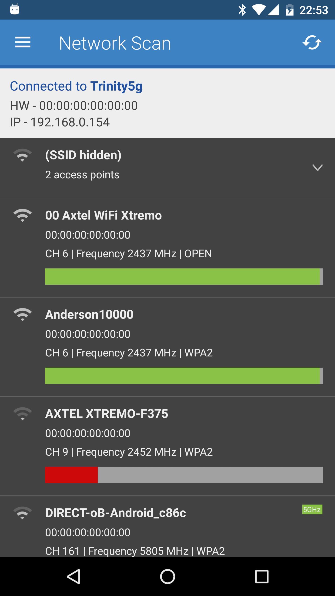
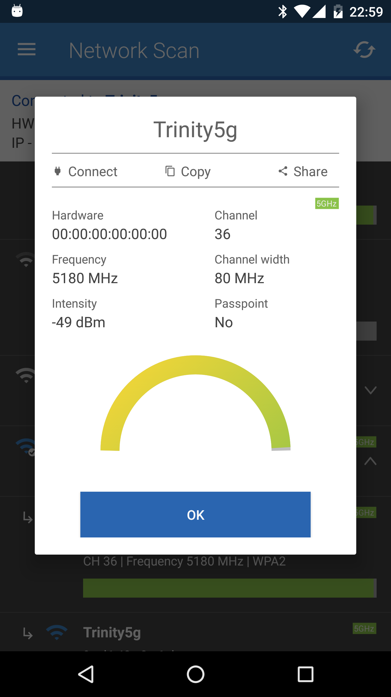
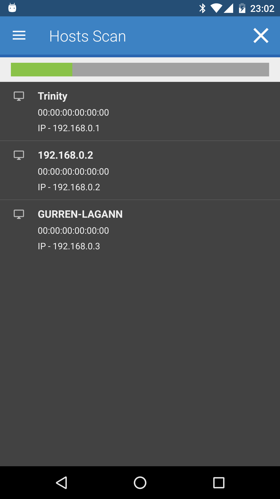
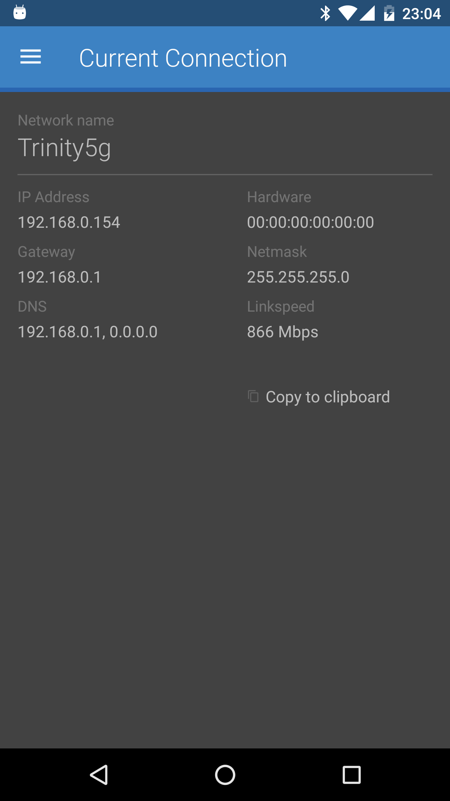

# WifiInfo #

WifiInfo shows a detailed description of the Wi-Fi connections around you (including hidden networks), besides an scanner to detect other devices in your network and some other features.

## Screenshots

___
You can also get it on Google Play:

